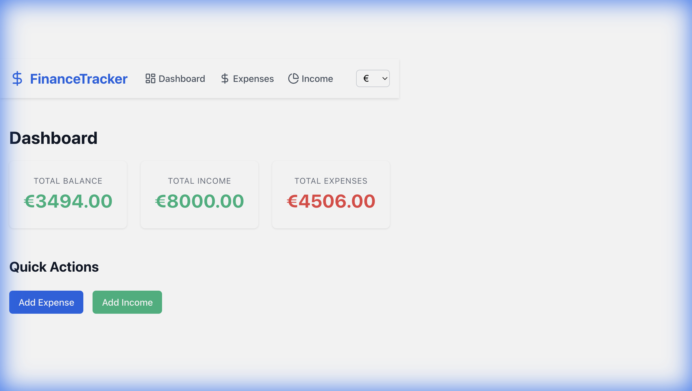
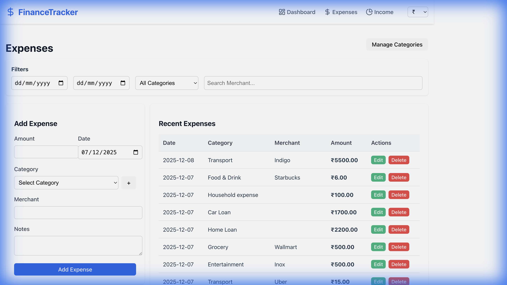
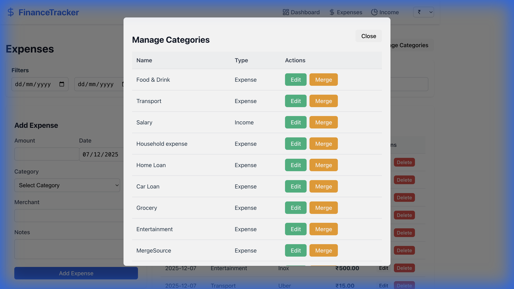

# Personal Finance Expense Tracker

A comprehensive personal finance application built with Python (FastAPI) and React.

## Features Implemented
- **Dashboard**: View total balance, income, and expenses with **Currency Support**.
- **Expenses**: Add, view, edit, delete, **Search**, and **Filter** expenses.
- **Income**: Add, view, edit, delete, **Search**, and **Filter** income.
- **Category Management**: 
    - Inline category management (create, rename).
    - **Merge Categories**: Merge one category into another (e.g., "Transport" -> "Travel"), moving all transactions automatically.
- **Currency Selection**: Switch between ₹, $, €, £, C$ instantly.
- **AI Suggestions**: Auto-suggest category based on merchant name.

## Verification Results
End-to-end testing confirmed:
1.  **Currency Switching**: Verified switching between currencies updates all views.
2.  **Category Merge**: Verified backend logic moves expenses and deletes the old category.
3.  **Search & Filters**: Verified filtering expenses by Date, Category, and Merchant.
4.  **UI Improvements**: 
    - Verified "Edit" (Green) and "Merge" (Amber) buttons in Category Manager.
    - Verified "Edit" buttons in Expense/Income lists are now **Green**.

### Dashboard Screenshot (Euro Currency)


### Expenses Page (Filtered by Merchant "Uber", Green Edit Buttons)


### Category Manager (New UI Colors)


## How to Run
### Backend
1.  Navigate to `backend/`
2.  Activate virtual environment: `source venv/bin/activate`
3.  Run server: `uvicorn main:app --reload`

### Frontend
1.  Navigate to `frontend/`
2.  Run server: `npm run dev`
3.  Open `http://localhost:5173`

---

# Walkthrough - Budgets & Alerts

I have implemented the Budgets & Alerts feature, allowing users to set monthly/weekly budgets, track utilization, and receive overspend alerts.

## Changes

### Backend
- **Database**: Updated `Budget` model to support `period_type` (monthly/weekly), `start_date`, and nullable `category_id` (for overall budgets).
- **API**:
    - Created `GET /budgets/status` endpoint to calculate spent, remaining, utilization %, and projections.
    - Created `POST /budgets/` and `GET /budgets/` endpoints.
- **Schemas**: Updated Pydantic schemas to support new Budget fields and response models.

### Frontend
- **Page**: Added `Budgets` page (`/budgets`).
- **Components**:
    - `BudgetForm`: To create/update budgets.
    - `BudgetCard`: To visualize budget status with progress bars and alerts.
- **Navigation**: Added "Budgets" link to the Navbar.
- **Service**: Added budget API calls to `api.js`.

## Verification Results

### Backend Verification
I ran a manual test script `backend/test_budgets_manual.py` to verify the logic.

**Test Scenario:**
1.  Create a "Food" category.
2.  Set a monthly budget of $500 for "Food".
3.  Add an expense of $150 for "Food".
4.  Check status.

**Result:**
```
Creating Category...
Category created: 1
Creating Budget...
Budget created: {'amount': 500.0, 'period_type': 'monthly', 'start_date': '2025-12-08', 'category_id': 1, 'id': 1, 'category': {'name': 'Food', 'type': 'expense', 'id': 1}}
Adding Expense...
Expense added.
Checking Status...
Budget Status: Spent=150.0, Remaining=350.0, Utilization=30.0%, Projected=581.25
SUCCESS: Budget calculations are correct.
```

### Frontend Verification
The frontend code has been updated to consume the new API endpoints. The `BudgetCard` component dynamically changes color (Green/Yellow/Red) based on utilization and shows an alert icon if over budget.

## Next Steps
- Run the frontend (`npm run dev`) and navigate to `/budgets` to use the feature.
- Ensure `finance.db` is reset or migrated if using an existing database.

### Launch Recording


### Refinement Verification Recording


### UI Improvements Verification
**Tabular Layout & Edit:**


**Delete Verification:**


### Relaunch Verification


### Blank Page Fix Verification


### Enhancements Verification
**Projected Spend & Over Budget Badge:**


**Blinking Alert Verification:**


### UI Alignment Verification
**Aligned UI & Graphs:**
